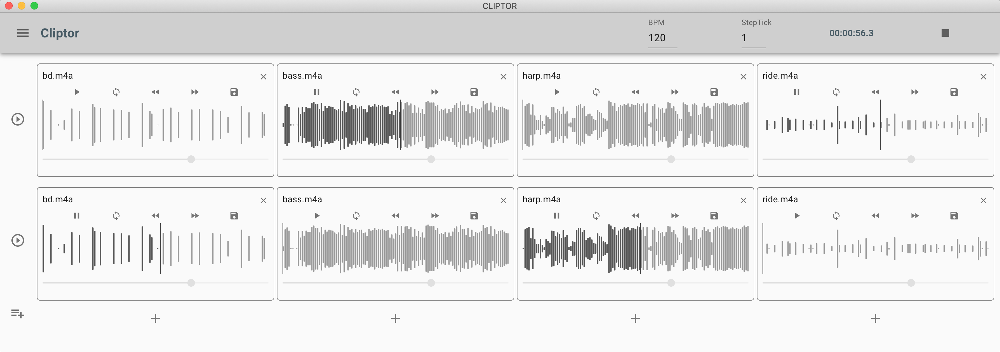

<p align="center">
  
</p>

# Cliptor

This app is supposed to just start a couple of samples via buttons. For example you could add, start and stop a sample "hooray" and a sample "applause" or even start whole tracks. However, start the app, add your clips, drag and drop your files to the clips and you can start mixing and looping.

Note: You better install the app on your OS to have all features available.

## Features

- Easy extending your clip matrix: Add tracks or add clips to tracks
- Drag and Drop your sample file easily to your clips for every track
- Cliptor reads all common sound files like mp3, wav, ogg or flac
- Start, Stop and Pause your clips
- Have different Audio-Driver Output for every clip available
- Change volume for each clip
- Seek forward or backward during playback ( yes you can do kind of DJing with Cliptor)
- Start scenes, similar to ableton live
- Load from or save your current settings to a preset file

## Download and Install

Go to https://github.com/TimSusa/cliptor/releases and find the latest or beta release. There is a caret with "assets". Please click the caret to have the download links available.

- Mac OSX: Please, download the \*.dmg File (can be seen on "assets" at the bottom here) and double click
- Windows 7 and above: Please, download the \*.exe File (can be seen on "assets" at the bottom here) and double click
- Raspberry-pi 4 and above: Please, download the AppImage File, chmod +x the file to make it executable and then start it

## Live-Web-Demo

Note: This is just for demo purposes. Better download and install (https://github.com/TimSusa/cliptor/releases ) the electron app to enjoy all the features.

https://cliptor.timsusa.vercel.app/

<p align="center">
  
</p>

## Installation

At first copy the .env.sample to .env, if you have none.

```
yarn
```

# Webapp

The webapp will not work properly with dragging and dropping files. This is only supported int eh elctron app.

## Start Development

```
yarn start
```

## Build for Production

```
yarn build
```

# Electron App

The app can be installed from packages for MacOSX, Rasperry Pi and Win. If you like to develop or build for yourself, please follow the instructions.

## Start Development

```
yarn dev
```

## Build for MacOSX, Rasperry Pi and Win

```
yarn build-ci
```

# Contributing

Please consider to create a PR with or without any issue.
I will get back to you, asap.

# Versioning

https://github.com/conventional-changelog/standard-version
